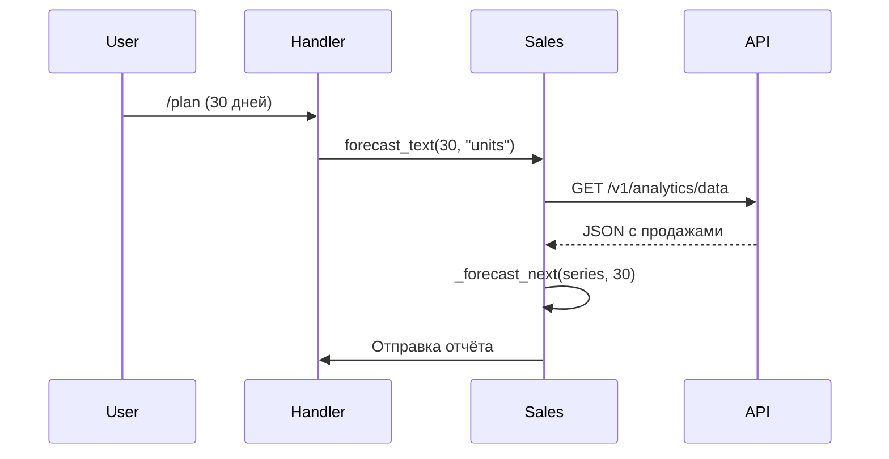
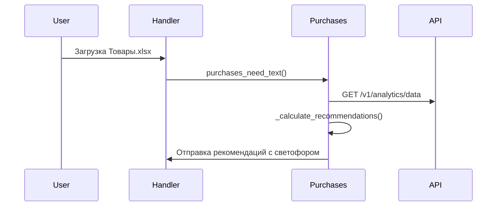
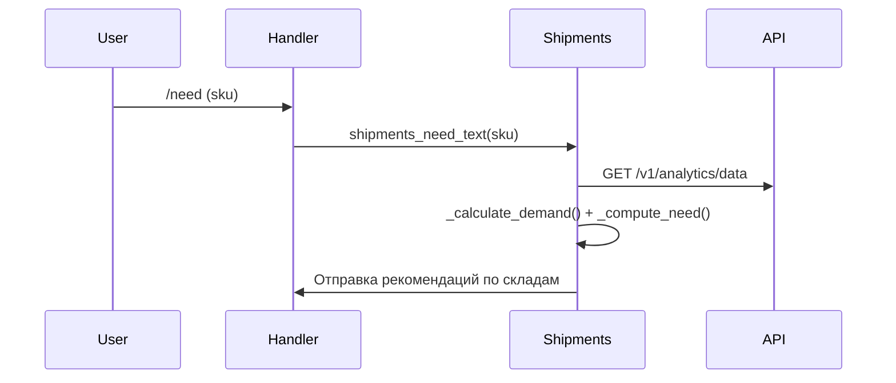
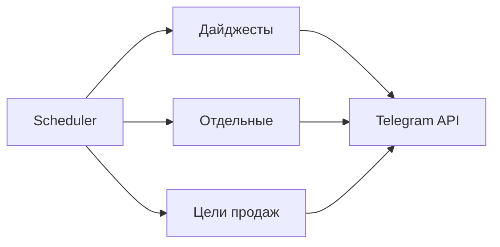

# Архитектура Ozon Seller Bot

## Обзор

Bot — это Telegram бот для автоматизации управления продажами, выкупами и отгрузками на маркетплейсе Ozon.

## Архитектурные слои

```mermaid
graph TB
    subgraph "Presentation Layer"
        UI[Menu.py\nInline-меню]
        HNDL[Handlers/\nОбработчики]
    
    subgraph "Business Logic Layer"
        SALES[Modules Sales/\nПродажи]
        PURCH[Modules Purchases/\nВыкупы]
        SHIP[Modules Shipments/\nОтгрузки]
    
    subgraph "Data Layer"
        CONFIG[Config Package/\nНастройки]
        CMMN[Modules Common/\nОбщие модули]
    
    subgraph "Infrastructure"
        API[Ozon API\nAnalytics, FBO]
        SCHED[Scheduler/\nПланировщик]
    
    UI --> HNDL
    HNDL --> SALES
    HNDL --> PURCH
    HNDL --> SHIP
    SALES --> API
    PURCH --> API
    SHIP --> API
    CONFIG --> SALES
    CONFIG --> PURCH
    CONFIG --> SHIP
    CMMN --> SCHED
```

## Детальный состав

### 1. Presentation Layer (UI)

#### menu.py
**Назначение:** Inline-меню бота

**Ключевые функции:**
- Генерация inline-клавиатур
- Кнопки «Назад» и «Домой»
- Callback-клавиатуры для выбора параметров

**Зависимости:** Нет

#### handlers/
**Назначение:** Обработка команд и callback-кнопок

**Модули:**
- `handlers_sales.py` — Продажи (план, факт, цели, отчёты)
- `handlers_purchases.py` — Выкупы (загрузка Excel, рекомендации)
- `handlers_shipments_*.py` — Отгрузки (статус, потребность, сроки)

**Зависимости:**
- `modules_sales/*`
- `modules_purchases/*`
- `modules_shipments/*`
- `menu.py`

### 2. Business Logic Layer

#### modules_sales/
**Назначение:** Логика продаж

**Модули:**
- `sales_facts_store.py` — Хранение фактов продаж в кэше
- `sales_forecast.py` — Прогнозирование (MA, ES)
- `sales_goal.py` — Цели продаж по SKU
- `sales_report.py` — Отчёты по продажам
- `sales_buyout.py` — Выкупы (в разделе Продажи)

**API интеграция:**
- `/v1/analytics/data` — Данные о продажах и выручке

**Формулы:**
- MA (скользящее среднее): `sum(last_n_values) / n`
- ES (экспоненциальное сглаживание): `s_t = alpha * x_t + (1-alpha) * s_{t-1}`
- Прогноз на horizon дней: `daily_avg * horizon`

**Зависимости:**
- `config_package`
- `modules_common/paths`

#### modules_purchases/
**Назначение:** Логика закупок

**Модули:**
- `purchases_need.py` — Рекомендации по закупкам
- `purchases_report_data.py` — Данные для отчётов
- `purchases_need_data.py` — Данные о потребностях

**Алгоритм:**
```
Потребность = Плановый_30д * BUY_COEF - (Остаток_у_продавца + Остаток_на_Ozon)
```

**Светофорная логика:**
- 🟥 Дефицит: `Потребность < Plan * (1 - BUY_RED_FACTOR)`
- 🟡 Норма: `Plan * (1 - BUY_YELLOW_FACTOR) <= Потребность <= Plan`
- 🟢 Профицит: `Потребность > Plan * (1 + PROF_RED_FACTOR)`

**Зависимости:**
- `config_package`
- `modules_sales/*`

#### modules_shipments/
**Назначение:** Логика отгрузок

**Модули:**
- `shipments_need.py` — Рекомендации по отгрузкам
- `shipments_demand.py` — Потребность по складам (3 методики)
- `shipments_leadtime*.py` — Сроки доставки (L/S)
- `shipments_report_data.py` — Данные для отчётов

**Методика потребности (3 варианта):**
1. **Average** — Среднесуточный спрос по истории
2. **Dynamics** — Динамика заказов по дням недели
3. **Hybrid** — Адаптивный гибрид двух методов

**Plan-First методика:**
```
Base_Need = Плановый_30д * Коэффициент_безопасности
Upper_Need = Base_Need * Коэффициент_светофора
Recommendation = Upper_Need - Остаток_на_Ozon
```

**Зависимости:**
- `config_package`
- `modules_sales/*`
- `modules_common/*`

### 3. Data Layer

#### config_package/
**Назначение:** Централизованная конфигурация с валидацией

**Модули:**
- `settings.py` — Pydantic Settings
- `constants.py` — Enum константы
- `env_helpers.py` — Helper функции

**Основные настройки:**
```python
# Telegram
telegram_token: str
chat_ids: List[int]
cb_dedup_window_ms: int

# Ozon API
ozon_client_id: str
ozon_api_key: str
ozon_company_id: str

# Прогноз продаж
es_alpha: float = 0.3
alert_plan_horizon_days: int = 30

# Закупки
buy_coef: float = 5.0
buy_red_factor: float = 4.0
buy_yellow_factor: float = 4.25

# Отгрузки
ship_safety_coef: float = 2.0
ship_round_step: int = 2
ship_red_factor: float = 1.5

# Цели продаж
goal_red_factor_high: float = 1.20
goal_yellow_factor_low: float = 0.95
```

**Enum константы:**
- `ForecastMethod` — MA7/14/30/60/90/180/360, ES
- `DemandMethod` — Average, Dynamics, Hybrid, Plan Distribution
- `TrafficMetric` — ordered_units, revenue, avg_price, cvr, ctr
- `ShipmentStatus` — DEFICIT, ENOUGH, SURPLUS
- `PurchaseStatus` — DEFICIT, ENOUGH, SURPLUS
- `NoticeCode` — Коды уведомлений

**Зависимости:**
- Pydantic Settings
- Python standard library

#### modules_common/
**Назначение:** Общие утилиты

**Модули:**
- `paths.py` — Пути к директориям (data/, cache/, ...)
- `calendar.py` — Календарь, работа с датами
- `units.py` — Управление списком юнитов

**Зависимости:**
- `config_package`

### 4. Infrastructure

#### scheduler.py
**Назначение:** Планировщик уведомлений

**Типы уведомлений:**
- **Дайджесты:** Полный, сокращённый
- **По отдельности:** Факт, план, конверсия, CTR, закупки, отгрузки
- **Цели продаж:** Напоминания о загрузке Excel

**Расписание:**
- `DAILY_NOTICES_WEEKDAY_AT` — будни
- `DAILY_NOTICES_WEEKEND_AT` — выходные
- `DAILY_NOTICES_WEEKDAY_PM_AT` — будни вечера
- `DAILY_NOTICES_WEEKEND_PM_AT` — выходные вечера
- `FULL_DIGEST_WEEKDAY_AT` — полное утреннее

**Зависимости:**
- `config_package`
- `modules_sales/*`
- `modules_purchases/*`
- `modules_shipments/*`
- Aiogram (Telegram Bot API)

#### Ozon API

**Эндпоинты:**
- `/v1/analytics/data` — Данные о продажах и выручке
- `/v2/posting/fbo/list` — FBO остатки (план)

**Аутентификация:**
```python
headers = {
    "Client-Id": settings.ozon_client_id,
    "Api-Key": settings.ozon_api_key,
}
```

**Rate limiting:**
- `OZON_MIN_INTERVAL = 65` — минимальный интервал между запросами
- Retry-механизм с экспоненциальным backoff
- Уважение заголовка `Retry-After`

### 5. Entry Points

#### bot.py
**Назначение:** Основная точка входа бота

**Инициализация:**
1. Загрузка .env с поддержкой разных кодировок
2. Инициализация Aiogram Dispatcher
3. Регистрация handlers
4. Запуск polling

**Зависимости:**
- `config_package`
- `handlers/*`
- `menu.py`

#### main.py
**Назначение:** Альтернативная точка входа (для отладки)

**Различия от bot.py:**
- Логирование в консоль
- Дополнительные debug-сообщения
- Трассировка ошибок

## Потоки данных

### Поток продаж



### Поток закупок



### Поток отгрузок



### Поток уведомлений



## Кэширование

### Кэш фактов продаж
**Местоположение:** `data/cache/sales/facts_cache.json`

**Данные:**
```json
{
  "rows": {
    "123456": [
      {"date": "2024-01-01", "units": 10.0, "revenue": 5000.0},
      ...
    ]
  }
}
```

**Партиционирование:**
- По SKU
- По дате
- TTL: Не ограничено (обновляется вручную)

### Кэш прогноза
**Местоположение:** `data/cache/sales/forecast_method.json`

**Данные:**
```json
{
  "method": "ma30"
}
```

### HTTP-кэш (in-memory)
**Реализация:** Микро-LRU в `modules_sales/sales_forecast.py`

**Параметры:**
- Размер: 128 записей
- Eviction: FIFO (удаление половины при переполнении)
- TTL: Сессия процесса

## Обработка ошибок

### Graceful degradation

**Пример в scheduler.py:**
```python
# Если модуль недоступен, используем фолбэк
try:
    from modules_sales.sales_facts_store import forecast_text
except ImportError:
    def forecast_text(*args, **kwargs):
        return "⚠ Модуль прогноза недоступен"
```

### Retry-механизм

**Реализация:** `modules_sales/sales_forecast.py`

```python
def _sleep_with_backoff(attempt: int, retry_after_header: Optional[str]) -> None:
    if retry_after_header:
        pause = float(retry_after_header)
        time.sleep(min(pause, SALES_API_MAX_PAUSE))
        return
    
    base = min(
        SALES_API_BASE_PAUSE * (2 ** max(0, attempt - 1)),
        SALES_API_MAX_PAUSE
    )
    jitter = base * random.uniform(0.0, SALES_API_JITTER)
    time.sleep(base + jitter)
```

## Структура проекта

```
ozon-seller/
├── config_package/              # Конфигурация
│   ├── __init__.py
│   ├── settings.py
│   ├── constants.py
│   └── env_helpers.py
├── handlers/                   # Обработчики
│   ├── handlers_sales.py
│   ├── handlers_purchases.py
│   └── handlers_shipments_*.py
├── modules_sales/              # Модули продаж
│   ├── sales_facts_store.py
│   ├── sales_forecast.py
│   ├── sales_goal.py
│   └── sales_report.py
├── modules_purchases/           # Модули закупок
│   ├── purchases_need.py
│   └── purchases_report_data.py
├── modules_shipments/           # Модули отгрузок
│   ├── shipments_need.py
│   ├── shipments_demand.py
│   └── shipments_leadtime*.py
├── modules_common/              # Общие модули
│   ├── paths.py
│   ├── calendar.py
│   └── units.py
├── typed_dicts.py              # TypedDict для типизации
├── tests/                      # Тесты
├── bot.py                      # Основная точка входа
├── main.py                     # Альтернативная точка входа
├── scheduler.py                 # Планировщик
├── menu.py                     # Inline-меню
├── requirements.txt              # Зависимости
├── .env.example                  # Пример конфигурации
└── .env                        # Ваша конфигурация
```

## Безопасность

### API ключи
- Хранятся в `.env` (не коммитится)
- Валидация при старте бота
- Проверка обязательных полей

### Дросселирование
- Минимальный интервал между запросами к API
- Retry-механизм с экспоненциальным backoff
- Уважение заголовков rate limit

### Тайминг
- Таймаут запросов: 30 секунд
- Пауза между сообщениями в дайджесте
- CB dedup window для защиты от быстрых кликов

## Производительность

### Оптимизации
- In-memory LRU-кэш для API запросов
- Batch-загрузка данных (до 1000 записей)
- Пагинация для больших списков

### Метрики
- Количество запросов к API за сессию
- Время отклика API
- Количество кэш-хитов и промахов

## Мониторинг

### Логирование
- INFO: API запросы, изменения конфигурации
- WARNING: Фолбэки, недоступные модули
- ERROR: API ошибки, критичные проблемы

### Метрики (план)
- Prometheus exporter (будущие версии)
- Sentry для error tracking (будущие версии)
